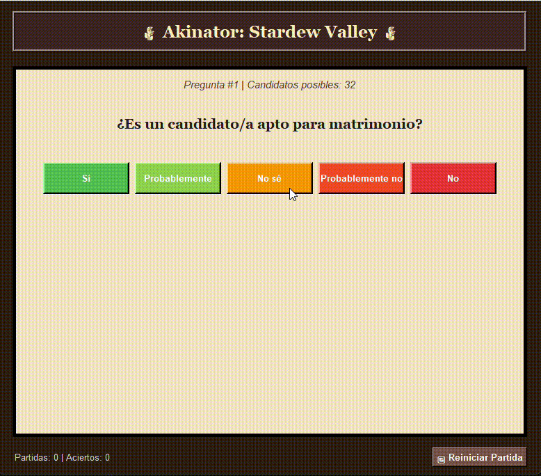

# 🌾 Stardew Akinator - Rule-Based Expert System

> An Akinator-inspired character guessing expert system set in the universe of *Stardew Valley*. Developed as an academic project for the Programming Paradigms course.


---

## Demo

<p align="center">
  
</p>

---

## How It Works (Architecture)
The project implements a **hybrid architecture** that combines the power of functional programming with the flexibility of procedural design for the user interface:

1. **Inference Engine & Knowledge Base (Scheme):** All logic rules, the decision tree, facts, and the evaluation of characteristics for *Stardew Valley* villagers are programmed purely in Scheme, applying symbolic processing and recursion concepts.
2. **Presentation Layer (Python / Tkinter):** A friendly, theme-tailored Graphical User Interface (GUI) that interacts with the user, captures their responses (Yes / No / Don't know), and communicates with the logical core to navigate the expert system's rules.

---

## Key Features
* **Dynamic Rule Engine:** Evaluates logical conditions based on the traits and features of Pelican Town inhabitants (favorite gifts, location, profession, gender, etc.).
* **Attractive Graphical Interface:** Built in Python using `Tkinter`, visually styled around the game's aesthetic.
* **Inter-paradigm Communication:** Efficient integration between Scheme scripts and Python.
* **Extensible Knowledge Base:** Rules and character profiles can be easily updated from the logical structure in Scheme.

---

## Technologies & Tools
* **Languages:** Python, Scheme.
* **Graphical Interface:** Tkinter (Python).
* **Version Control:** Git & GitHub.

---
## Prerequisites
Make sure you have the following installed on your system:
* [Python](https://www.python.org/) (version 3.x recommended).
* A Scheme interpreter or environment compatible with the codebase (e.g., *Racket*, *Chez Scheme*).

### Validate the knowledge base

The Racket validator checks entity names, feature names, allowed values,
duplicate facts, missing characteristics, and rule references:

```bash
racket Backend/validador.rkt
```

Structural problems return a failing exit code. Missing characteristics are
reported as warnings because the inference engine treats omitted facts as
`desconocido`.

## Protocol

The Python frontend and Racket backend communicate using versioned JSON Lines.
The current protocol version is `1`. See the complete contract in
[`docs/protocol.md`](docs/protocol.md).

The process bridge also applies a read timeout, captures backend diagnostics
from `stderr`, reports malformed responses, and supports clean shutdown and
explicit motor restart through `SchemeBridge.reiniciar()`.

## Logging

The application writes rotating logs to `logs/stardew-akinator.log`. The
directory is intentionally kept in the repository only through
`logs/.gitkeep`; generated log contents are ignored by Git. Logging includes
motor lifecycle events, protocol messages, response time, communication
errors, image-loading failures, and per-game question counts.

The log level defaults to `INFO` and can be changed without editing code:

```powershell
$env:STARDEW_AKINATOR_LOG_LEVEL = "DEBUG"
python -m Frontend.app
```
