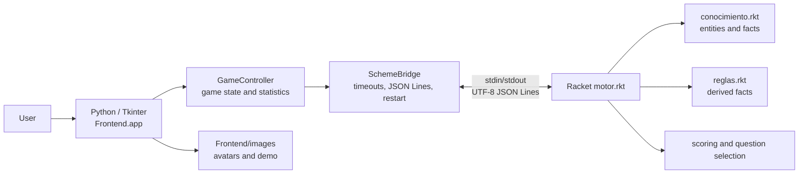
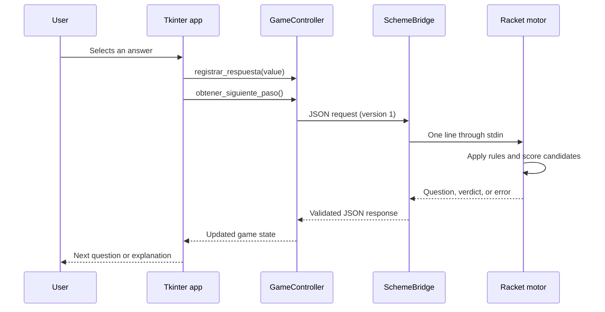

# Architecture Overview

## System context

Stardew Akinator is a desktop application with a deliberately small
two-process architecture:

## Runtime request flow

## Responsibilities

| Component | Responsibility | Deliberate boundary |
| --- | --- | --- |
| `Frontend/app.py` | Tkinter window, user interaction, visible errors | Does not implement inference |
| `Frontend/game_controller.py` | Answers, asked features, statistics | Does not know process details |
| `Frontend/scheme_bridge.py` | Starts Racket, sends JSON, enforces timeout and protocol version | Does not score characters |
| `Backend/motor.rkt` | JSON adapter, inference loop, verdict and explanation | Does not render UI |
| `Backend/conocimiento.rkt` | Character facts and domain vocabulary | Does not communicate with Python |
| `Backend/reglas.rkt` | Derived facts and rule application | Does not manage sessions |
| `Backend/validador.rkt` | Knowledge-base consistency checks | Runs independently in CI |

## Failure handling

The process boundary is treated as an explicit contract rather than as an
implementation detail:

- A response that exceeds the bridge timeout raises `TimeoutError`.
- A terminated process or broken pipe raises `ConnectionError`.
- Invalid JSON or an incompatible protocol version raises `ValueError`.
- Backend diagnostics are captured from `stderr` and included in logs/errors.
- `reiniciar()` terminates the current process and starts a clean instance.
- The UI displays communication failures instead of treating them as a game
  verdict.

The complete field-level contract is documented in
[`protocol.md`](protocol.md). The integration test exercises the real process
boundary, while unit tests cover bridge failure paths without requiring a
running GUI.

## Quality evidence

The architecture is checked by the CI workflow:

1. Python unit and Python-Racket integration tests.
2. Coverage measurement with a 75% minimum for backend-facing Python modules.
3. Ruff linting and formatting checks.
4. Mypy type checking.
5. Racket knowledge-base validation and `rackunit` tests.

